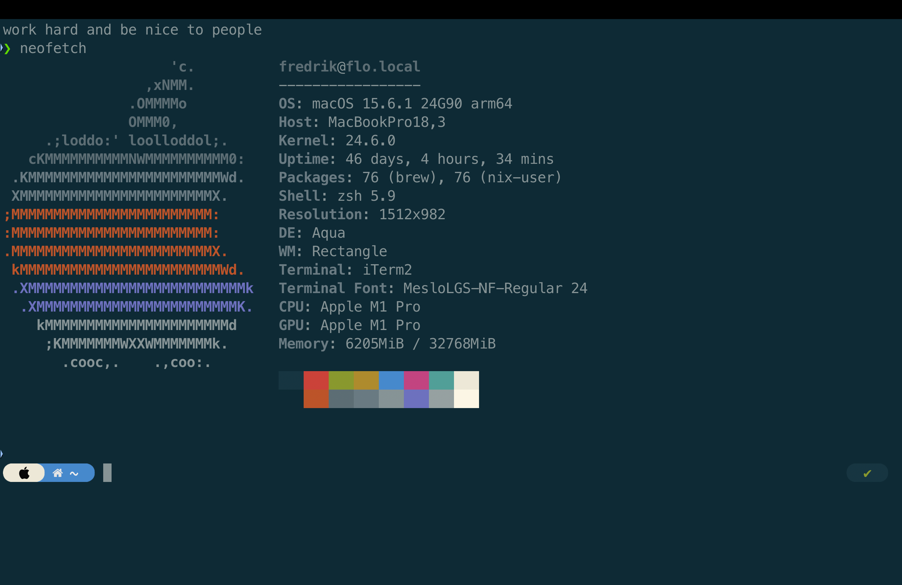

# Fredrik's ~/

## Overview

This repository tracks my macOS dotfiles and shell configuration for _flo_, my Macbook at Knowit.

## Core Setup

**Shell Environment**
- **Shell**: Zsh with Oh My Zsh framework
- **Theme**: Powerlevel10k
- **Key Plugins**: git, python, zsh-autosuggestions, fzf-tab
- **Navigation**: zoxide
- **Environment Management**: direnv for per-project configuration

**Package Management**
- Homebrew for macOS packages and tools
- Nix for reproducible package management
- uv for Python version management
- nvm for Node.js version management

**Development Tools**
- Git with delta pager for enhanced diff visualization
- Git configured with patience diff algorithm, autosquash, and automatic rebasing
- GitHub CLI (gh) for repository management
- MinIO client (mc) for S3-compatible storage
- SOPS with age encryption for secrets management

**Modern CLI Replacements**
- **eza** - modern replacement for ls with colors and git integration
- **bat** - cat with syntax highlighting and line numbers
- **ripgrep (rg)** - faster grep that respects .gitignore
- **fd** - simpler and faster alternative to find
- **dust** - intuitive disk usage visualization
